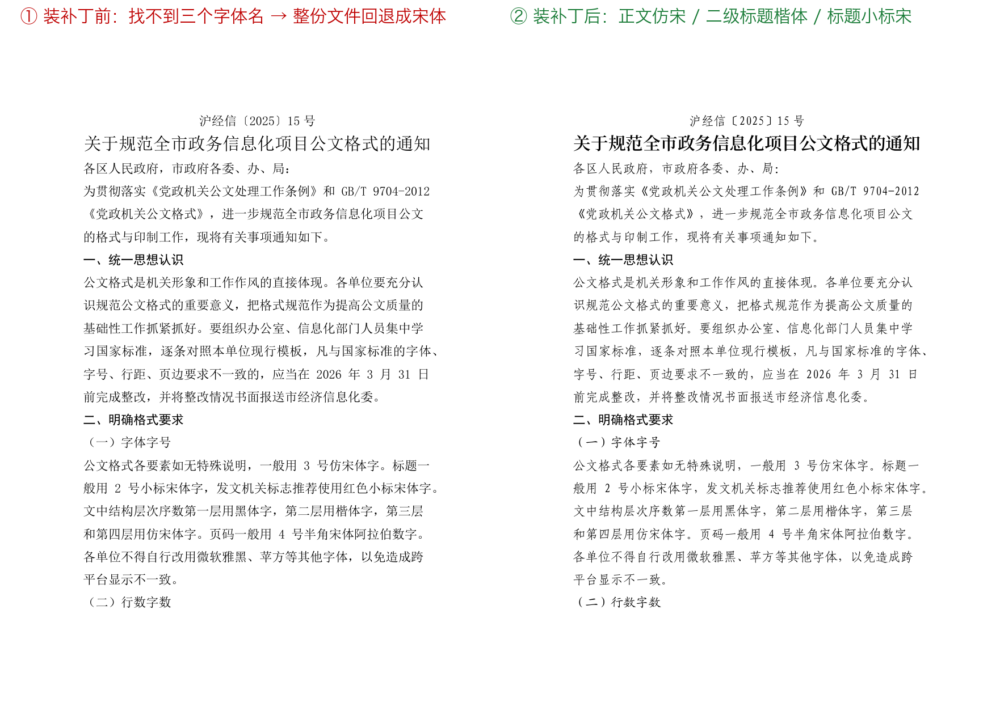
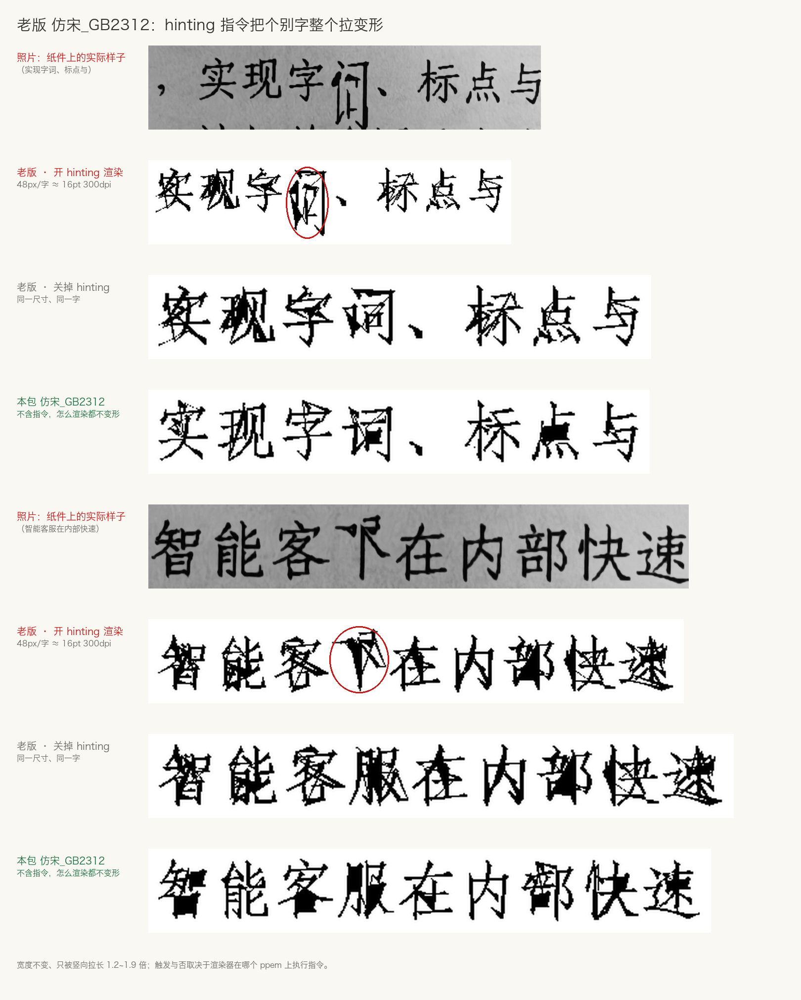

# 修复版国标公文字体

让包含 `仿宋_GB2312`、`楷体_GB2312`、`方正小标宋简体` 的公文电子文档，在 macOS 上正常显示与打印。

## 装之前 / 装之后

同一份公文（正文仿宋、二级标题楷体、标题小标宋），在 Word for Mac 里未配置好字体时，会回退至宋体：



## 故障原因

### 一、老版仿宋 / 楷体的 hinting 指令会把个别字整个拉变形

纸件照片与复现对照：



纸质打印件会有错版现象。老版 90 年代仿宋字形里 hinting 指令本身有问题，渲染链路执行后个别字会变形，直接关掉 hinting 就恢复正常。

本包 `仿宋_GB2312` / `楷体_GB2312` 已修复完毕。

## 注意！

国标公文需使用 `仿宋_GB2312`、`楷体_GB2312`、`方正小标宋简体` 这些 Windows 字体名，而 macOS 没有字体别名机制。装上本包后将用修复后的字体替换原先的字体名。

## 安装

```bash
brew tap BronyaCat/gongwen

# 新版 Homebrew 需要先信任这个 tap，否则会报 untrusted tap
brew trust --cask bronyacat/gongwen/gongwen-fonts

brew install --cask gongwen-fonts
```

装完退出 Word 再打开，文档里不需要做任何设置。

## 卸载

```bash
brew uninstall --cask gongwen-fonts
```

## 字体来源

| 提供的名字 | 来源 |
|---|---|
| `仿宋_GB2312` | 长城 `仿宋_GB2312`（Windows 原版） |
| `楷体_GB2312` | 长城 `楷体_GB2312`（Windows 原版） |
| `方正小标宋简体` | 思源宋体 SemiBold |

---

> 这个仓库 2021 年就建好了，中间停了五年。五年前那份说明见 [README-2021.md](README-2021.md)。
